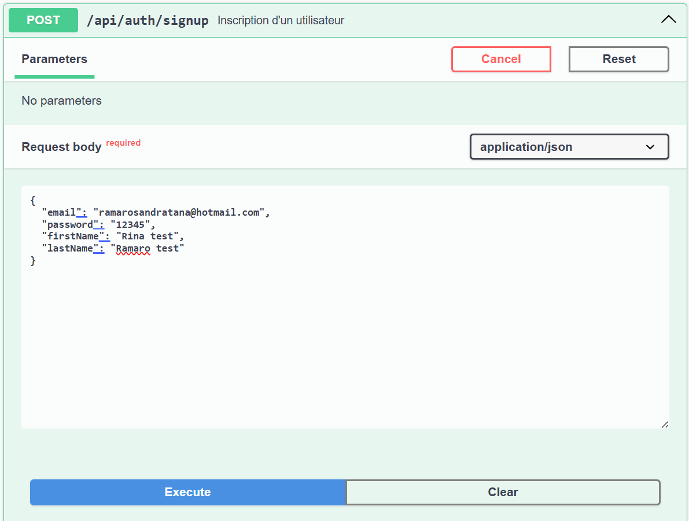
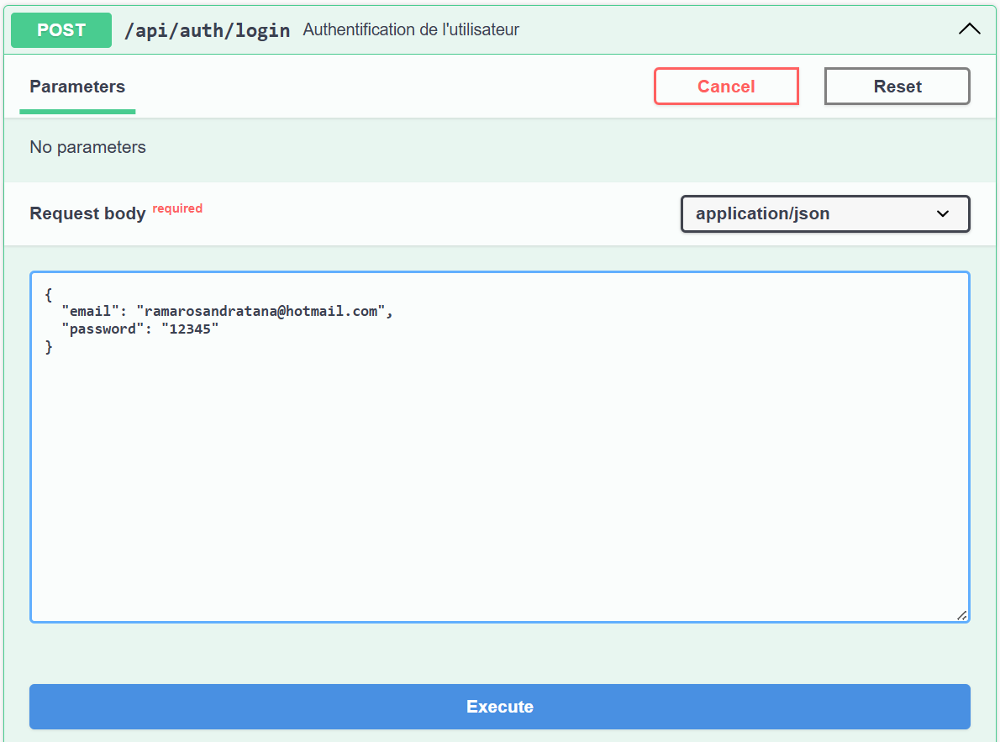

# Projet Fournisseur d'Identité

## **Description**

Ce projet implémente un fournisseur d'identité sous forme d'API REST, développé avec **Spring Boot** et conteneurisé avec **Docker**. Il permet :

- L'inscription des utilisateurs avec validation par email.
- L'authentification multifacteur avec PIN envoyé par email.
- La gestion des comptes utilisateurs (modification des informations sauf email).
- Une gestion sécurisée des mots de passe et des sessions.
- Une documentation API générée automatiquement via **Swagger**.

---

## **Fonctionnalités**

### 1. Inscription

- Création d'un compte utilisateur.
- Validation de l'email via un lien.

### 2. Authentification multifacteur

- Connexion avec email et mot de passe.
- Vérification d'un PIN temporaire (valide 90 secondes) envoyé par email.

### 3. Gestion des comptes

- Modification des informations personnelles de l'utilisateur (sauf l'email).

### 4. Sécurité

- Hashage sécurisé des mots de passe avec **BCrypt**.
- Limitation des tentatives de connexion (paramétrable, par défaut 3).
- Réinitialisation des tentatives via email.
- Réinitialisation automatique après une connexion réussie.

### 5. Sessions

- Gestion des sessions avec durée de vie paramétrable.
- Utilisation de **JSON Web Tokens (JWT)** pour l'authentification.

### 6. Documentation API

- Documentation générée automatiquement via **Swagger/OpenAPI**.

---

## **Prérequis**

### **Instalation locale**

- **Java 21+**
- **Maven 3.9+**
- **PostgreSQL 15+**

### **Instalation via Docker**

- **Docker** et **Docker Compose**

---

## **Installation et Lancement**

### 1. Cloner le projet

```bash
git clone https://github.com/rarianaAina/cloudProject.git
cd cloudProject
```

### 2. Construire et lancer avec Docker

```bash
docker-compose up --build
```

### 3. Accéder à l'application

- API Swagger : `http://localhost:8443/swagger-ui/index.html`

---

## **Structure du Projet**

### **Arborescence principale**

```plaintext
├── src
│   ├── main
│   │   ├── java
│   │   │   └── com.auth
│   │   │       ├── AuthApplication     # Point d'entrée de l'application
│   │   │       ├── controller          # Controleurs de l'application
│   │   │       ├── dto                 # DTO (Data Transfer Object)
│   │   │       ├── entity              # Entités de données
│   │   │       ├── repository          # Accès aux données
│   │   │       ├── service             # Logique metier
│   │   │       └── config              # Configuration (security, swagger...)
│   │   └── resources
│   │       └── application.yml     # Configuration de l'application
│   └── target
├── pom.xml                         # Fichier Maven
├── Dockerfile                      # Configuration Docker
├── .gitignore                      # Ignorer certains fichiers
├── .env                            # Variables d'environnement
├── docker-compose.yml              # Configuration Docker Compose
├── README.md                       # Documentation du projet
└── postman_collection.json         # Collection Postman pour tester l'API
```

---

## **Endpoints Principaux**

### **Authentification**

- Inscription d'un utilisateur  :

```bash
curl -X 'POST' \
  'http://localhost:8443/api/auth/signup' \
  -H 'accept: */*' \
  -H 'Content-Type: application/json' \
  -d '{
    "email": "your_email@example.com",
    "password": "your_password",
    "firstName": "Your First Name",
    "lastName": "Your Last Name"
  }'
```

- Connexion d'un utilisateur :

```bash
curl -X 'POST' \
  'http://localhost:8443/api/auth/login' \
  -H 'accept: */*' \
  -H 'Content-Type: application/json' \
  -d '{
  "email": "string",
  "password": "string"
}'
```

### **Utilisateur**

- Vérification de l'email et utilisation du PIN :

```bash
curl -X 'POST' \
  'http://localhost:8443/api/auth/verify-2fa/your_email/your_pin' \
  -H 'accept: */*' \
  -d ''
```

- Modifier les informations personnelles :

```bash
curl -X 'PUT' \
  'http://localhost:8443/api/auth/update?email=test%40test.com' \
  -H 'accept: */*' \
  -H 'Content-Type: application/json' \
  -d '{
  "firstName": "string",
  "lastName": "string",
  "password": "string"
}'
```

- Vérification de l'email via un lien :

```bash
curl -X 'GET' \
  'http://localhost:8443/api/auth/verify-email/test' \
  -H 'accept: */*'
```

---

## **Tests API**

- Utiliser le fichier **Postman Collection** fourni : `postman_collection.json`.
- Importer la collection dans Postman pour tester les différents endpoints.

---

## **Contributeurs**

### **Nom et Prénom :**

- **Rariana Miadana** : **ETU00001**
- **Harena Andraina Ramarosandratana** : **ETU00002**
- **Larry Joann** : **ETU00003**
- **Mampionona Rinasoa Ramarosandratana** : **ETU00015**

### ***Liste des tâches :***

`[[text](https://docs.google.com/spreadsheets/d/14Y1N1uY1NLFILozMZSLSuBJScVtQY2m_s2X9kR4YFu4/edit?usp=sharing)]`

---

## **Documentation Technique**

### 1. Modèle Conceptuel des Données (MCD)

Inclure un diagramme du modèle conceptuel des données pour présenter les relations entre les entités principales.

### 2. Scénarios d'utilisation

- Inscription et validation par email.


- Authentification multifacteur avec PIN.

- Gestion des comptes utilisateurs.


### 3. Choix Techniques

- **Spring Boot** : Framework rapide et robuste pour les API REST.
- **BCrypt** : Sécurité des mots de passe.
- **JWT** : Gestion des sessions sécurisée.
- **Docker** : Déploiement simple et portable.

---
